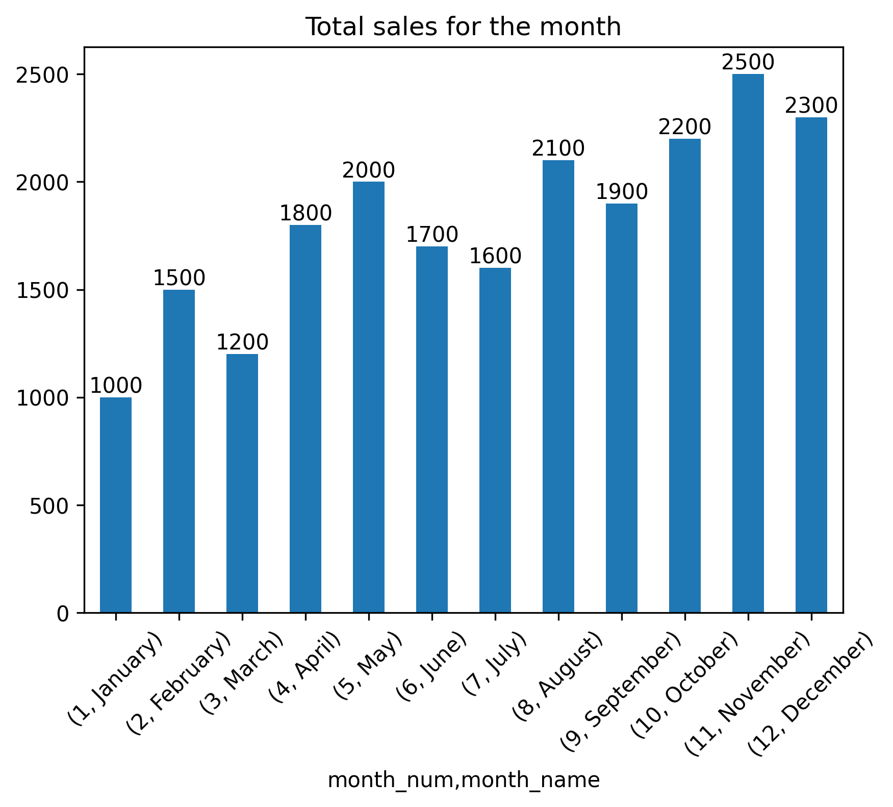

# تحليل مبيعات المتجر 🛒

تحليل بسيط لإجمالي المبيعات الشهرية باستخدام بيانات Excel وأدوات Python.

## 📁 وصف المشروع:
المشروع يحتوي على كود Python يقوم بـ:
- قراءة بيانات المبيعات من ملف Excel.
- تحويل تواريخ الطلبات لتواريخ فعلية.
- حساب إجمالي المبيعات لكل شهر.
- عرض النتائج في رسم بياني باستخدام matplotlib.

## 🧰 الأدوات المستخدمة:
- pandas
- matplotlib
- Python

## 📝 خطوات تشغيل الكود:
1. تأكد من وجود الملف `store_sales.xlsx` في نفس مجلد الكود.
2. افتح الملف البرمجي وشغله سطر بسطر.
3. هيظهر رسم بياني يوضح إجمالي المبيعات لكل شهر.

## 📊 الرسم البياني الناتج:
يعرض إجمالي المبيعات لكل شهر من شهور 2024 حسب بيانات ورقة "2024" في ملف Excel.

يوضح إجمالي المبيعات الشهرية حسب التحليل.

---

## 📦 الملفات في المشروع:
- `store_sales.xlsx` → ملف البيانات
- `main4.py → ملف الكود 
